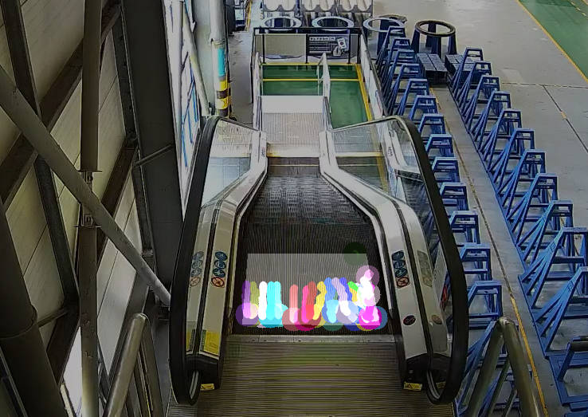

# Opencv 光流扶梯方向判断

### 更新内容：

1. 加入了从分割的json文件中自动获取光流法所需的ROI区域的代码

8月11更新

### 更新内容：

1. 代码重构，将原来的代码封装成了一个类
2. 逻辑优化，修改了之前的方向计算在逻辑上存在一点问题
3. 加入了一些过滤策略，主要是对于横向移动的位移以及前后摆动的特征点进行过滤
4. 优化方向的判断，取连续N个历史帧方向的多数方向作为当前帧扶梯方向，对于方向变化更加稳定

### 耗时分析
耗时主要耗在获取新的特征点这一部分，在代码中为**cv2.goodFeaturesToTrack()**函数，这个函数的在代码中的调用时机为：被跟踪的特征点的数量不够时，调用该函数获取一批新的特征点。因为随着扶梯的运动，有的特征点会运动到roi边缘和外部，又或者有的特征点没有被跟踪到，又或者被过滤掉了，导致特征点数量变少，少于一定值时，需要重新获取特征点以继续计算运动方向。因此视频中扶梯的光流特征越不明显，前一帧获取的特征点在下一帧就越难被跟踪到，从而导致频繁取调用**cv2.goodFeaturesToTrack()**函数获取新的特征点，因此速度就会越慢。
### 跳变说明
优化后对于跳变问题判断会更加稳定一些，但是对于光流特征不明显的情况，光流本身跟踪不到特征点点或者跟踪错误，跳变问题仍然存在。

